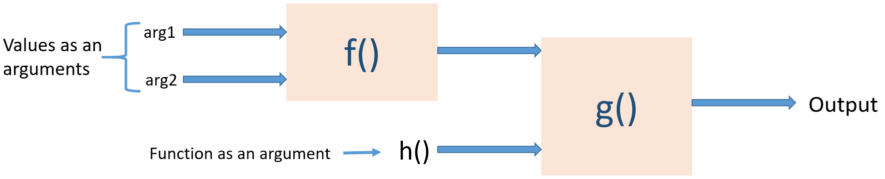
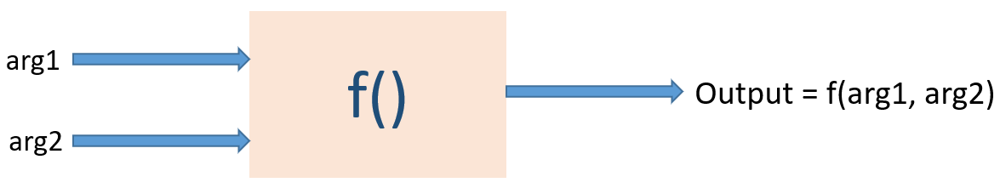

Instructions
<!-- .element: class="title" -->

<!-- Left side content -->

### How to use this slide set?
<!-- .element: style="text-align: center"-->
- As you read a slide, try checking out the results of the code given in slides
  You can use the online interactive prompt (**click logo on the bottom-right**)
  for quickly checking results.
- Use other online articles / materials to internalise the content in the slide
- Install Haskell (in any platform) - Introductory slides give how-to do this
- Code, code, code. Practise, practise, practise. **And don’t stop with these slides!**

 <!-- .element: style="line-height: 1.5; float:left; width: 49%; text-align: left;" -->

<!-- Right side content -->

### Navigation hints
<!-- .element: style="text-align: center"-->
- This slide-set is based on <a href="https://github.com/hakimel/reveal.js/" target="_blank">reveal.js</a>, so all the keyboard shortcuts from reveal.js are available in this. Press **'?'** for an overview of all keyboard shortcuts. 
- **Click on the Haskell India logo (on the bottom right) to open a Haskell Interactive prompt! You can try out live Haskell code on this.**

<!-- .element: style="line-height: 1.5; float: right; width: 49%; text-align: left;" -->

---

# 
<!-- .element: class="title" -->

# Introduction
<!-- .element: class="section-heading" -->
What is Haskell, and why is it called as a “Pure Functional Language”
<!-- .element: class="section-brief" -->

---

# Introduction
<!-- .element: class="title" -->

 
<!-- .element: style="line-height: 1;" -->

### What is Haskell?

Pure Functional Programming Language
<!-- .element: style="text-align: center;" -->

<!-- .element: style="border:0;" -->

“Functional Programming” is a style in which the basic method of computations is by _**application of functions to arguments**_.
In the illustration above:

- `f()` is **applied** to `arg1` and `arg2`
- `g()` is **applied** to output of `f()` and another function `h()`, i.e., _`h()` itself becomes an argument to `g()`!_

<!-- .element: style="text-align: left; line-height: 1.5;" -->

---

# Introduction
<!-- .element: class="title" -->

 
<!-- .element: style="line-height: 1;" -->

### What is "pure" FP?

Output depends only on the inputs, i.e., a function of only inputs.
<!-- .element: style="text-align: center;" -->

<!-- .element: style="border:0;" -->

Pure FP maintains **Referential Transparency**.

Every time `f()` is called with the same `arg1` and `arg2`, it always outputs the same value. In other words, `f()` can be replaced by its output value without affecting the program behaviour.

Now, why does this matter?

---

<!-- SLIDE 4 -->
Vertical slide example
<!-- .element: class="title" -->

Navigate down with a down-arrow

===

Vertical slide title here
<!-- .element: class="title" -->

Keep going down

===

Navigate up with a up-arrow

---

<!-- CREDITS -->

Credits
<!-- .element: class="title" -->

&lt;Name1&gt; [github-username](https://github.com/github-username>)

<!-- .element: style="font-family: 'Courier New', Courier, monospace;font-size: 20px" -->
        

&lt;Name2&gt; [github-username](https://github.com/github-username>)

<!-- .element: style="font-family: 'Courier New', Courier, monospace;font-size: 20px" -->

---

# 
<!-- .element: class="title" -->

# Thank you!
<!-- .element: class="section-heading" -->

Want more? Join the [Haskell India Group](https://t.me/haskellindia)!

<!-- .element: class="section-brief" -->